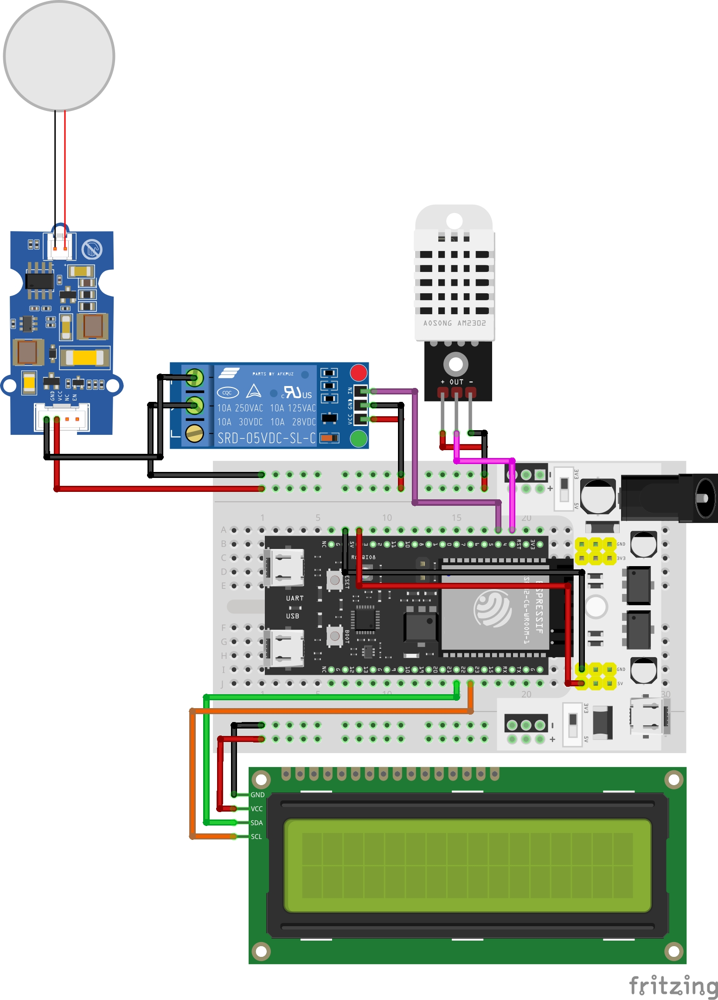
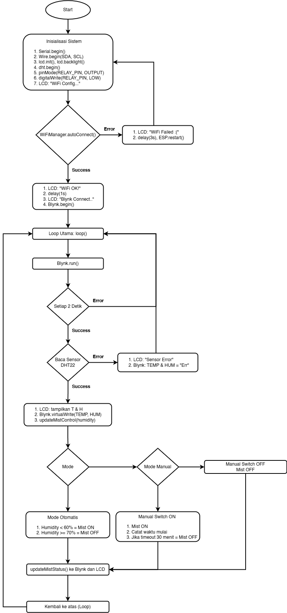

# 💧 IoT-Based Air Humidifier with ESP32

Proyek ini merupakan sistem **Air Humidifier otomatis** berbasis **ESP32 C6 WROOM 1** dengan dukungan **Blynk IoT Platform**, **Sensor DHT22**, **Relay SRD-05VDC-SL-C**, dan **LCD I2C** untuk monitoring suhu dan kelembapan serta pengendalian mist maker secara otomatis dan manual.

---

## 📁 Struktur Repositori

```bash
.
├── images/
│   ├── sketch_humidifier_bb.jpg
│   └── flowchart.png
├── src/
│   ├── main.cpp             
├── README.md                
├── platformio.ini           
```

## 🔧 Fitur Utama

- Monitoring suhu dan kelembaban secara real-time
- Mode Otomatis (Auto) dan Manual
- Batas kelembaban auto control: ON < 60%, OFF ≥ 70%
- Timeout otomatis untuk mode manual (30 menit)
- LCD menampilkan data suhu, kelembaban, status mist, dan mode
- Tombol reset WiFi langsung dari Blynk
- WiFiManager untuk konfigurasi WiFi tanpa hardcoding

## 📝 Deskripsi Singkat

IoT Air Humidifier ini bekerja dengan dua mode:
- Auto Mode: Mist maker akan aktif jika kelembapan < 70.9% dan akan mati jika > 85.0%.
- Manual Mode: Mist maker dikendalikan secara langsung via aplikasi Blynk.

LCD 1602 I2C menampilkan:
- Baris 1: Suhu & kelembapan (Contoh: T: 27.5C H: 66.3%)
- Baris 2: Mode dan status relay (Contoh: M: Auto S: ON)

## 📲 Blynk Integration
| Virtual Pin   | Fungsi                           |
|---------------|----------------------------------|
| `V0`          | Status Mode (0: Auto, 1: Manual) |
| `V1`          | Tombol kontrol manual mist       |
| `V2`          | Tampilan suhu                    |
| `V3`          | Tampilan kelembaban              |
| `V4`          | Status mist maker (ON/OFF)       |
| `V5`          | Tombol Reset WiFi                |

## 🧰 Hardware yang Digunakan

| Komponen         | Deskripsi                              |
|------------------|----------------------------------------|
| ESP32 C6 WROOM 1 | Mikrokontroler utama                   |
| DHT22            | Sensor suhu dan kelembaban             |
| LCD I2C 16x2     | Tampilan suhu, kelembaban, dan status  |
| Relay 5V         | Mengontrol mist maker                  |
| Mist Maker       | Penghasil kabut                        |
| Power Supply     | Distribusi daya                        |
| WiFiManager      | Untuk konfigurasi WiFi melalui portal  |
| Blynk IoT        | Platform pengendali IoT berbasis cloud |

## 📊 Diagram

  ### ⚡ Wiring Diagram

  

  ### 🔁 System Flowchart

  

## 📎 Referensi

- Blynk Docs: https://docs.blynk.io
- DHT Sensor Library: Adafruit DHT Sensor Library
- WiFiManager: https://github.com/tzapu/WiFiManager
